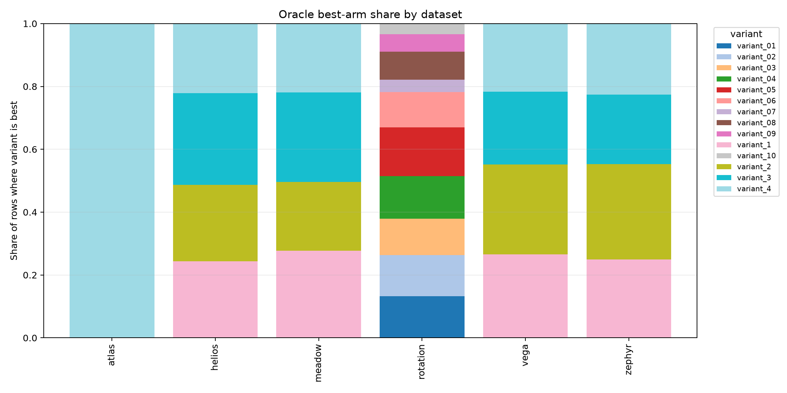
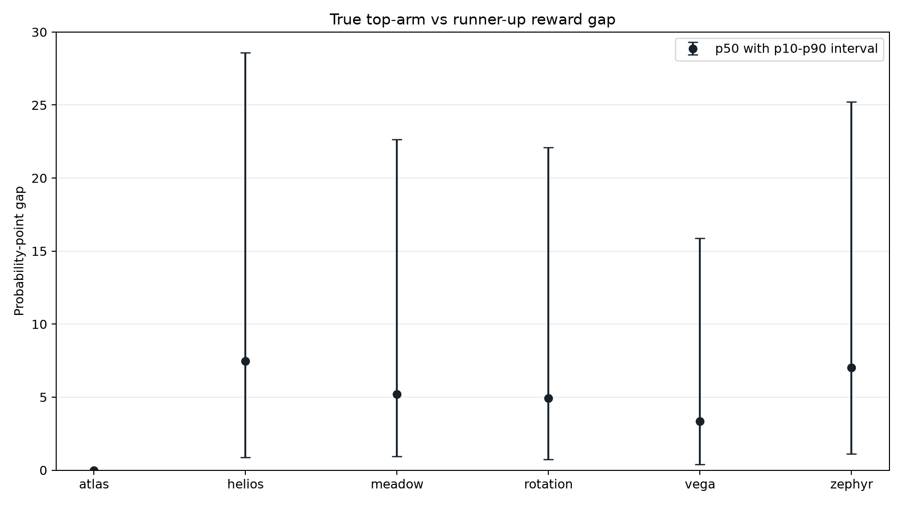
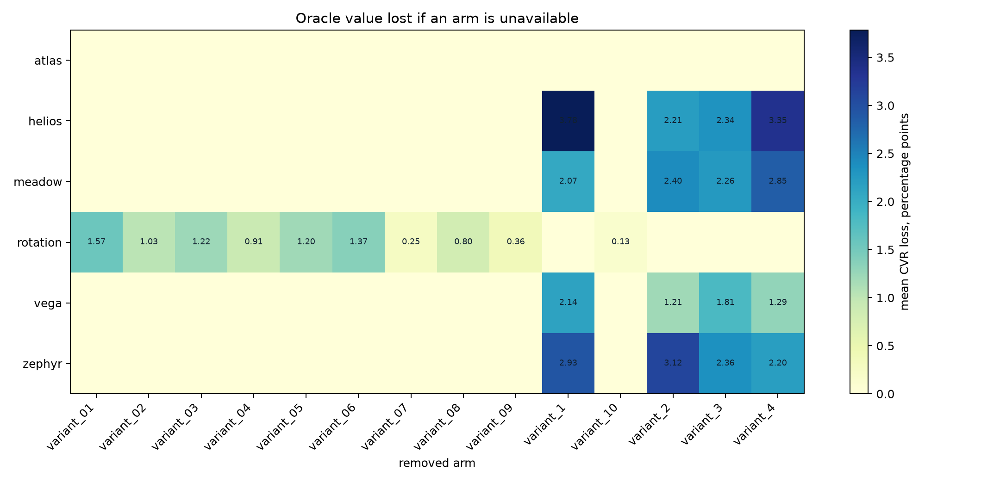

# Arm Sensitivity Diagnostics

These plots use the hidden truth files for analysis only. They are not used by the submitted policies.

## Displays

### oracle_winner_share.png

How often each variant is the true best arm for a row.

### top_second_gap.png

How much better the true best arm is than the runner-up. Small gaps mean arm choice is intrinsically noisy; large gaps mean getting the arm right matters.

### leave_one_arm_out_loss.png

Oracle CVR lost if each arm is removed from consideration.

## Summary tables

### Top-second gap

| dataset  | mean_top_second_gap_pp | p10_gap_pp | p50_gap_pp | p90_gap_pp |
| -------- | ---------------------- | ---------- | ---------- | ---------- |
| atlas    | inf                    | 0.0        | 0.0        | 0.0        |
| helios   | inf                    | 0.8614     | 7.4729     | 28.5719    |
| meadow   | inf                    | 0.9569     | 5.1891     | 22.6513    |
| rotation | inf                    | 0.7542     | 4.9298     | 22.094     |
| vega     | inf                    | 0.4083     | 3.3316     | 15.8843    |
| zephyr   | inf                    | 1.1046     | 7.0085     | 25.2253    |

### Largest leave-one-arm-out losses

| dataset  | variant    | leave_one_arm_out_loss_pp | share_rows_where_arm_is_best |
| -------- | ---------- | ------------------------- | ---------------------------- |
| atlas    | variant_1  | 0.0                       | 0.0                          |
| atlas    | variant_2  | 0.0                       | 0.0001                       |
| atlas    | variant_3  | 0.0                       | 0.0                          |
| helios   | variant_1  | 3.7846                    | 0.2434                       |
| helios   | variant_4  | 3.3524                    | 0.2211                       |
| helios   | variant_3  | 2.3351                    | 0.2918                       |
| meadow   | variant_4  | 2.8475                    | 0.2185                       |
| meadow   | variant_2  | 2.4038                    | 0.2184                       |
| meadow   | variant_3  | 2.2561                    | 0.2858                       |
| rotation | variant_01 | 1.5669                    | 0.1326                       |
| rotation | variant_06 | 1.365                     | 0.1125                       |
| rotation | variant_03 | 1.221                     | 0.1163                       |
| vega     | variant_1  | 2.141                     | 0.2655                       |
| vega     | variant_3  | 1.8126                    | 0.2313                       |
| vega     | variant_4  | 1.288                     | 0.217                        |
| zephyr   | variant_2  | 3.1168                    | 0.3023                       |
| zephyr   | variant_1  | 2.9327                    | 0.2499                       |
| zephyr   | variant_3  | 2.3645                    | 0.222                        |

### Oracle winner share

| dataset  | variant    | oracle_winner_share |
| -------- | ---------- | ------------------- |
| atlas    | variant_1  | 0.0                 |
| atlas    | variant_2  | 0.0001              |
| atlas    | variant_3  | 0.0                 |
| atlas    | variant_4  | 0.9999              |
| helios   | variant_1  | 0.2434              |
| helios   | variant_2  | 0.2437              |
| helios   | variant_3  | 0.2918              |
| helios   | variant_4  | 0.2211              |
| meadow   | variant_1  | 0.2773              |
| meadow   | variant_2  | 0.2184              |
| meadow   | variant_3  | 0.2858              |
| meadow   | variant_4  | 0.2185              |
| rotation | variant_01 | 0.1326              |
| rotation | variant_02 | 0.1304              |
| rotation | variant_03 | 0.1163              |
| rotation | variant_04 | 0.1355              |
| rotation | variant_05 | 0.1548              |
| rotation | variant_06 | 0.1125              |
| rotation | variant_07 | 0.0389              |
| rotation | variant_08 | 0.09                |
| rotation | variant_09 | 0.0556              |
| rotation | variant_10 | 0.0336              |
| vega     | variant_1  | 0.2655              |
| vega     | variant_2  | 0.2862              |
| vega     | variant_3  | 0.2313              |
| vega     | variant_4  | 0.217               |
| zephyr   | variant_1  | 0.2499              |
| zephyr   | variant_2  | 0.3023              |
| zephyr   | variant_3  | 0.222               |
| zephyr   | variant_4  | 0.2257              |
