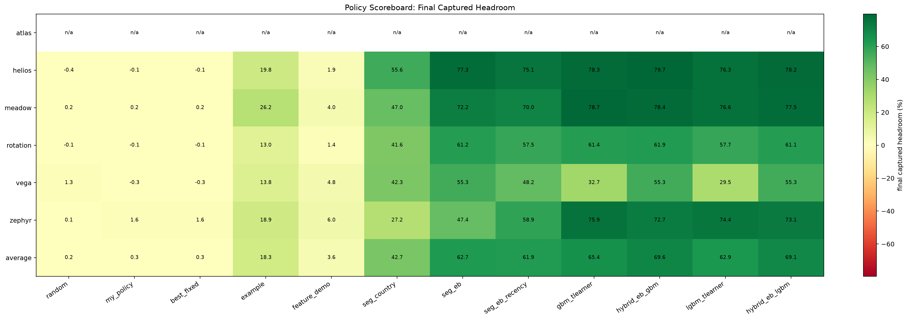
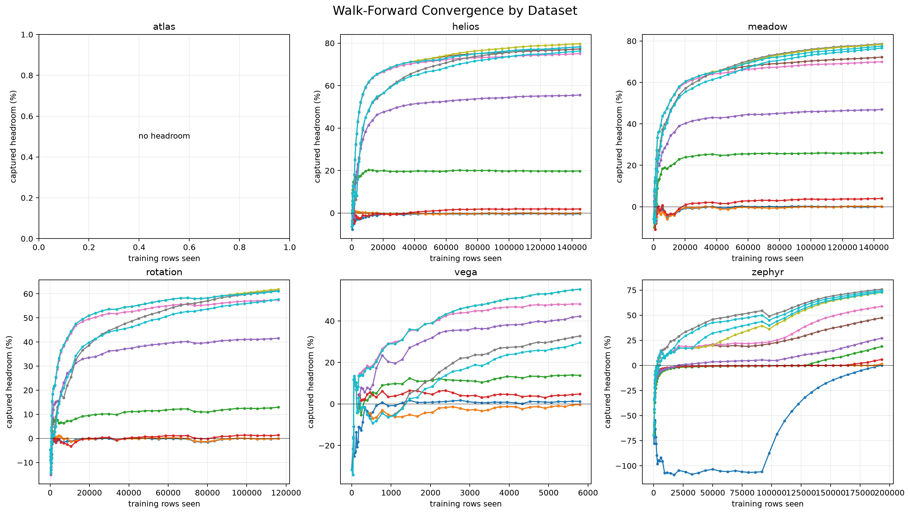
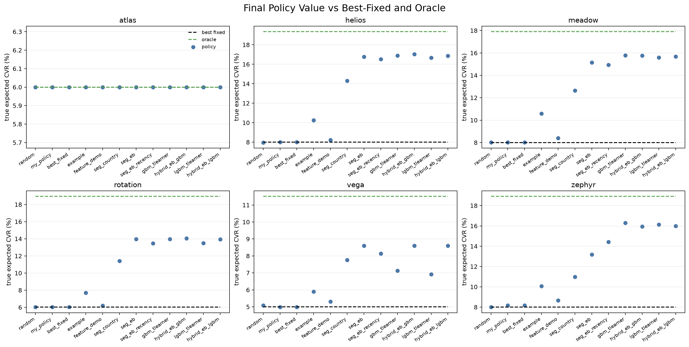
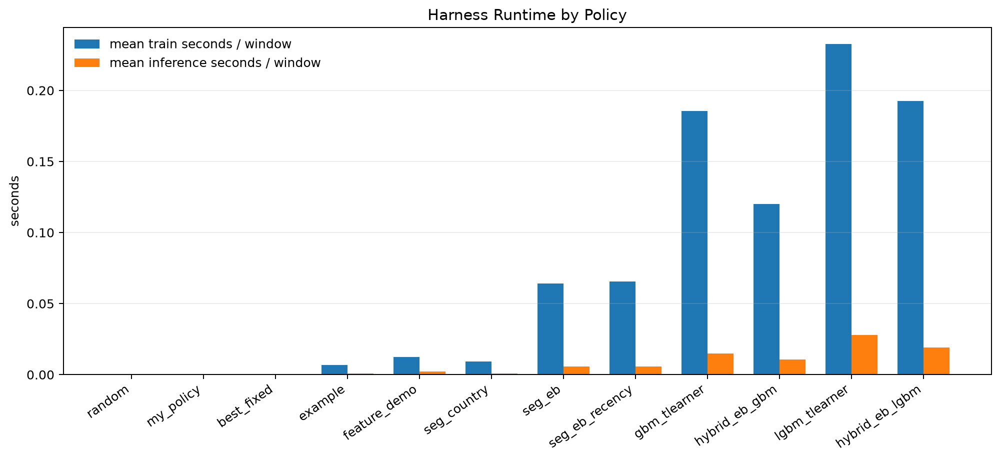
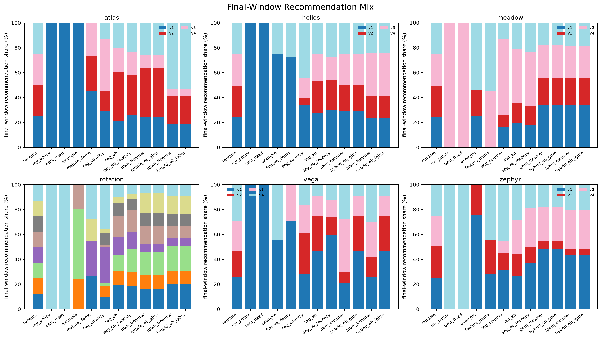
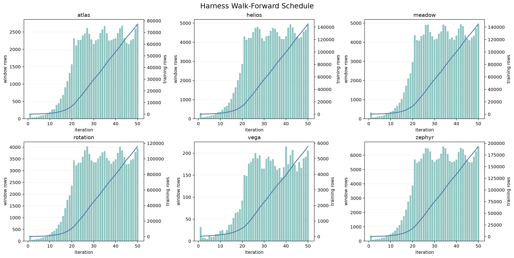
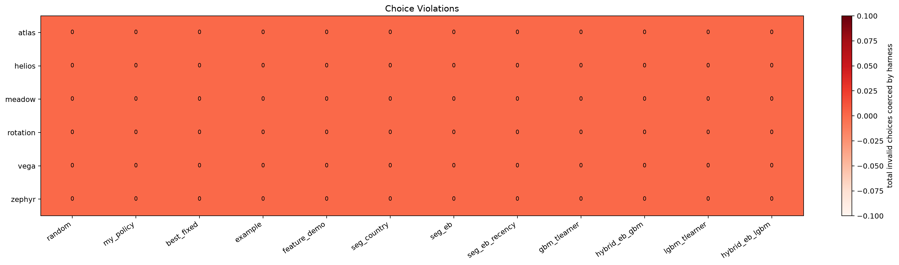

# Eval Observability Pack

These charts are generated from `solution/results/<dataset>/<policy>.jsonl`.
They explain the walk-forward harness, policy performance, latency, and
serving behavior. Regenerate with:

```bash
uv run python solution/eval_observability.py
```

## policy_scoreboard_heatmap.png

Final captured-headroom table by dataset and policy, including policy averages.



## captured_convergence_grid.png

Walk-forward convergence curves showing captured headroom versus training rows.



## final_value_components.png

Policy CVR against the best-fixed baseline and oracle ceiling.



## policy_runtime.png

Mean train and inference time per policy/window.



## final_recommendation_mix.png

Final-window recommendation distribution by dataset and policy.



## harness_walk_forward_windows.png

Window sizes and cumulative training set sizes used by the harness.



## choice_violations.png

Invalid action choices caught and replaced by the harness.


