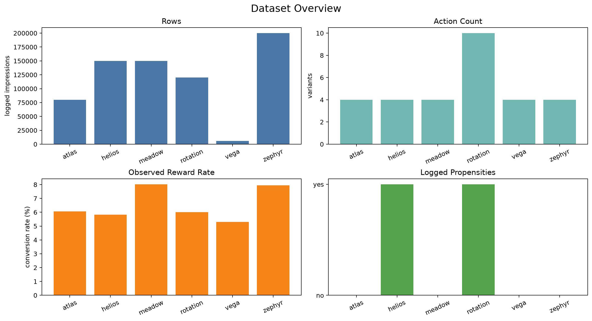
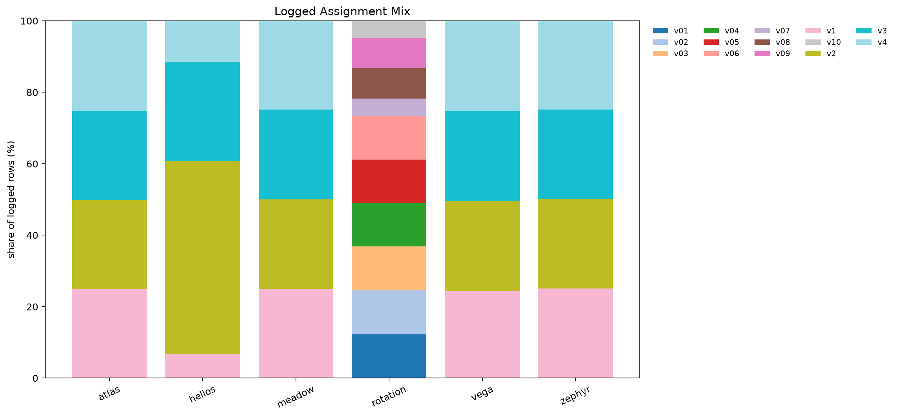
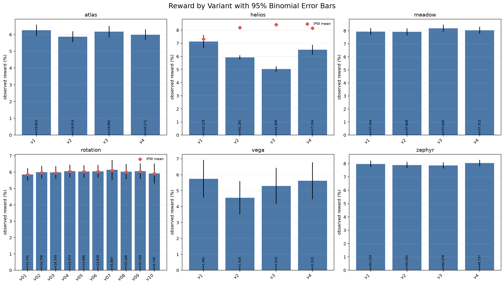
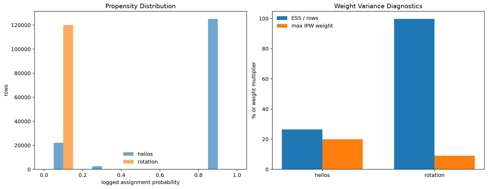
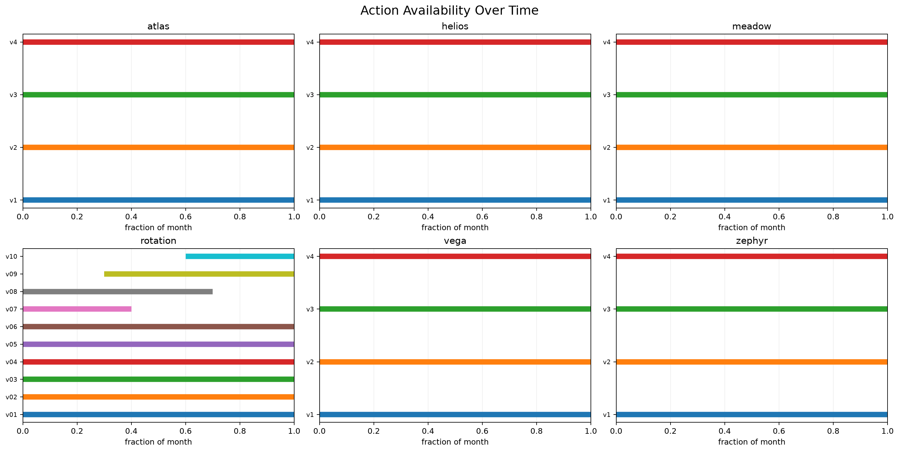
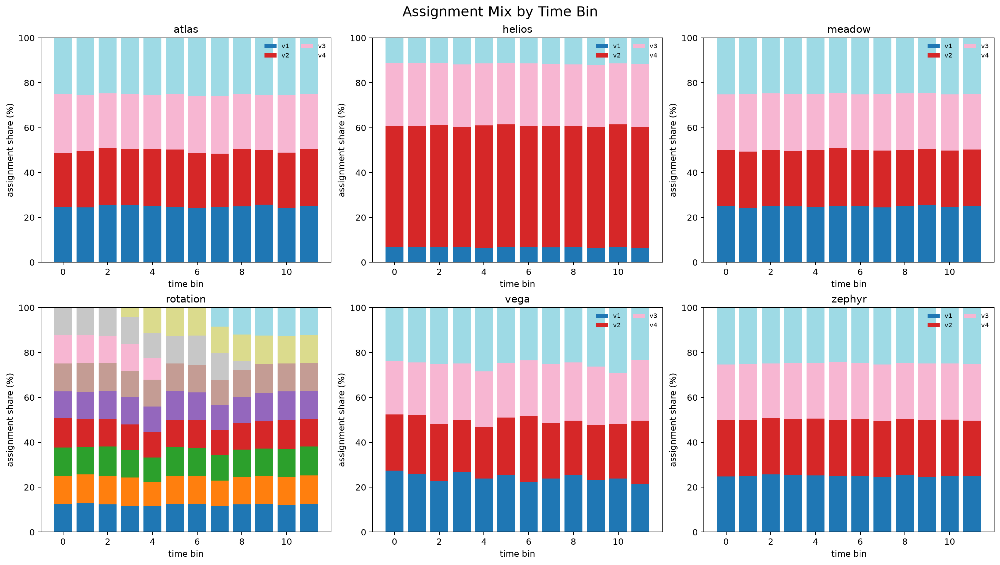
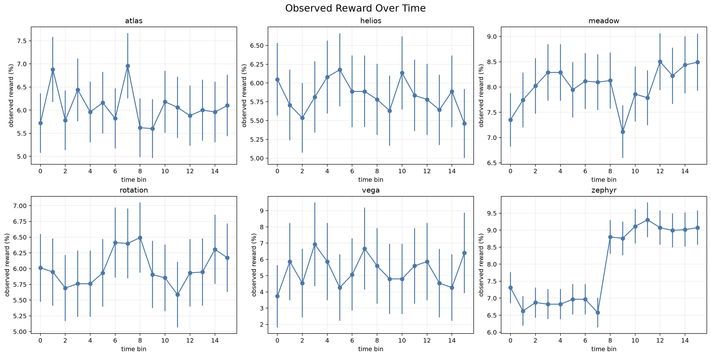
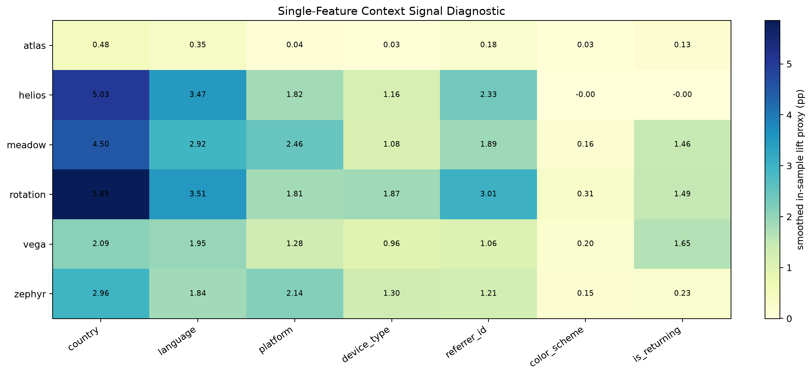

# Data Observability Pack

These displays summarize the logged data used by the policy. They are
generated from the observed logs, not from the hidden truth files.

## Displays

### overview.png

Dataset size, action count, observed reward rate, and whether propensities are logged.

### assignment_mix.png

Overall logged action mix by dataset.

### reward_by_variant_support.png

Observed reward by action with binomial uncertainty; red diamonds show IPW means where propensities exist.

### propensity_diagnostics.png

Propensity distributions and effective sample size diagnostics.

### action_availability.png

First-to-last appearance of each action over the month.

### temporal_assignment_mix.png

How assignment mix changes across chronological bins.

### temporal_reward.png

Observed conversion rate over chronological bins.

### segment_signal_heatmap.png

Single-feature smoothed segment signal proxy used to guide policy design.

